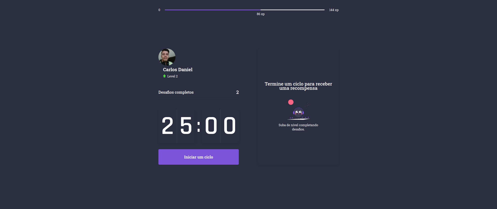

# Move.it

Aplicativo desenvolvido durante a semana #NLW4 da Rocketseat, seguindo a trilha de React.

Disponível para uso em: https://moveit-next-eight-sigma.vercel.app/
## Proposta(O problema / a solução)

Pessoas que trabalham todos os dias em frente ao computador quase sempre se esquecem de parar alguns minutos para fazer algum exercício ou simplesmente se alongar, e estudos mostram que a falta de movimento pode causar problemas de saúde [fonte](https://www.minhavida.com.br/saude/galerias/18936-nove-perigos-a-saude-de-passar-muitas-horas-do-dia-sentado), para ajudar a resolver esse problema o aplicativo web `move.it` conta com um sistema de notificação sonora simples que é ativado ao final do período de 25 minutos e quando o usuário realiza qualquer um dos exercícios propostos por `move.it` ele receberá um bônus de XP que o levará ao próximo nível na plataforma, esta é apenas uma forma de motivar o usuário a permanecer-se no caminho e fazer com que a prática de pequenos exercícios entre períodos de tempo seja um hábito comum em seu dia a dia.

## Reprodução em ambiente de desenvolvimento

- Crie um clone do repositório sem sua máquina.

- Acesse a pasta raiz do projeto e execute `npm install` para instalar as dependências com suas possíveis atualizações, ou execute `npm ci` para recuperar todas as dependências na versão exata que foram usadas durante o desenvolvimento.

- Execute `npm run dev` e o serviço estará disponível em http://localhost:3000

## Preview

